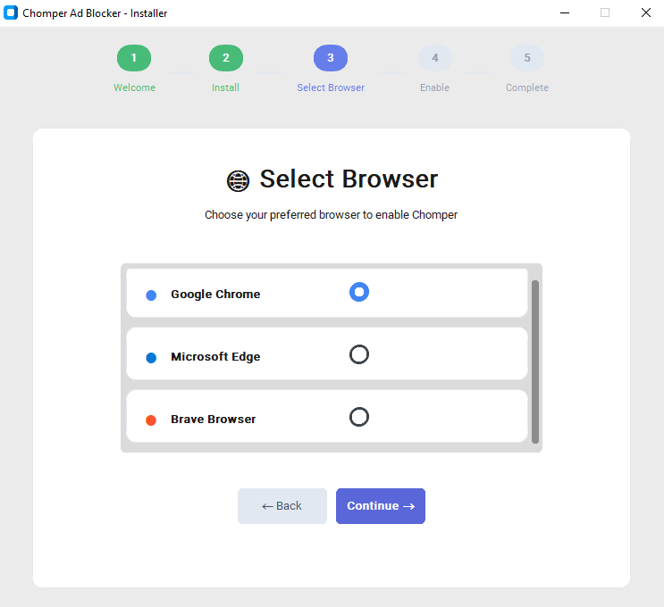
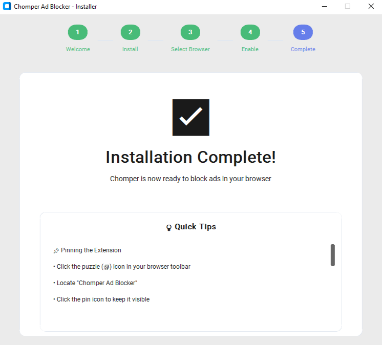
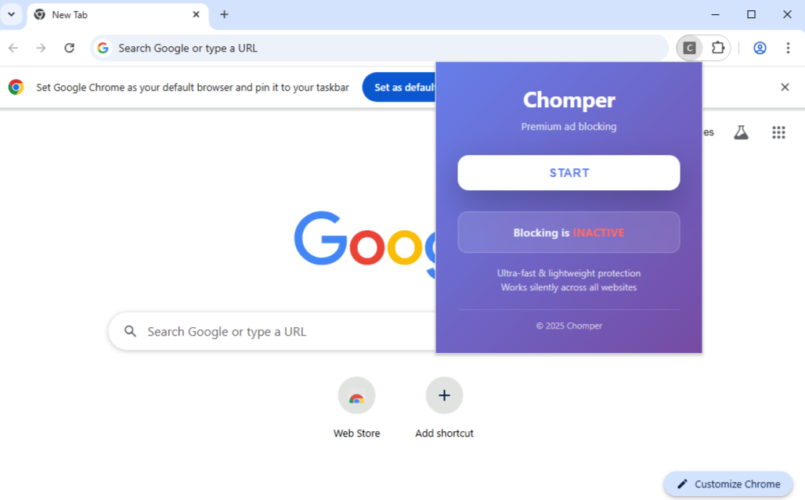
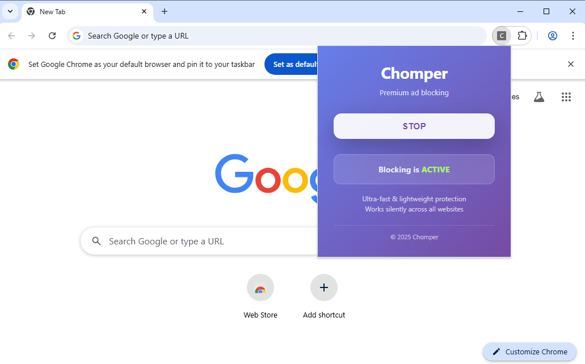

<p align="center">
  
</p>

<h1 align="center">Chomper</h1>
<p align="center">A tiny browser creature that eats ads for a living — an installer + browser ad-blocker extension.</p>

---

## Table of Contents

- [Description](#description)
- [Why Chomper](#why-chomper)
- [Installation](#installation)
- [Usage](#usage)
- [Screenshots](#screenshots)
- [Author](#author)
- [For Developers & Enthusiasts](#for-developers--enthusiasts)
- [License](#license)

---

## Description

Chomper is a lightweight ad-blocking project that combines:

- A **desktop installer** (Python based)  
- A **browser extension** Chomper blocks ads with high accuracy on major video-streaming sites (yes… yt 😉), while staying lightweight and unobtrusive.
---

## Why Chomper

Most ad blockers are heavy, complex, or intrusive. Chomper focuses on:

- **Efficiency:** Keeps *yt* watch sessions clean by quietly chomping through ads
- **Simplicity:** Easy to install and use, with no unnecessary configuration  
- **Clarity:** A clean and well-organized structure that is easy for both users and developers to understand

---

## Installation

### Installer (Recommended)

1. Download the latest **`chomper.exe`** from the Dist folder.
2. Run the installer and follow instructions  
3. The extension is set up automatically

### Manual Setup

1. Clone the repository:

```bash
git clone https://github.com/Mihirx86/chomper.git
```
2. In your browser, open: 
```bash
chrome://extensions/
```
3. Enable Developer Mode (usually a toggle in the top-right)

4. Click Load unpacked

5. Select the folder:
```bash
chomper_installer/chomper-ad-blocker/
```
6. Done — the extension is now active!


## Usage

Click the extension icon in your browser toolbar

Toggle ad-blocking on/off

Enjoy browsing with fewer ads

Minimal UI; focus on performance and simplicity.


## Screenshots
<p align="center">   </p> <p align="center">   </p> <p align="center">   </p> <p align="center">  </p>

## Author

(Mihir R Choure)- { Mihirx86 }
GitHub: https://github.com/Mihirx86

Email: Mihirchoure1504@gmail.com


## For Developers & Enthusiasts

Chomper is an open and evolving project. Any developer or enthusiast is welcome to join, experiment, and help improve it.

Whether you want to:
- Improve ad-blocking logic  
- Optimize performance on *yt* and other high-traffic sites  
- Enhance the extension UI  
- Refactor or extend the installer  

You’re encouraged to jump in.

There are no barriers to entry — if you’re curious, you’re already qualified. By contributing, you become part of the Chomper cult: a small group of people who enjoy building simple, effective tools and improving them piece by piece.

Fork the repository, make your changes, and submit a pull request. Every improvement, no matter how small, helps Chomper grow stronger.

## License

This project is open source and available under the MIT License.

MIT License

Copyright (c) 2026 Mihir

Permission is hereby granted, free of charge, to any person obtaining a copy
of this software and associated documentation files (the "Software"), to deal
in the Software without restriction, including without limitation the rights
to use, copy, modify, merge, publish, distribute, sublicense, and/or sell
copies of the Software, and to permit persons to whom the Software is
furnished to do so, subject to the following conditions:

The above copyright notice and this permission notice shall be included in all
copies or substantial portions of the Software.

THE SOFTWARE IS PROVIDED "AS IS", WITHOUT WARRANTY OF ANY KIND, EXPRESS OR
IMPLIED, INCLUDING BUT NOT LIMITED TO THE WARRANTIES OF MERCHANTABILITY,
FITNESS FOR A PARTICULAR PURPOSE AND NONINFRINGEMENT. IN NO EVENT SHALL THE
AUTHORS OR COPYRIGHT HOLDERS BE LIABLE FOR ANY CLAIM, DAMAGES OR OTHER
LIABILITY, WHETHER IN AN ACTION OF CONTRACT, TORT OR OTHERWISE, ARISING FROM,
OUT OF OR IN CONNECTION WITH THE SOFTWARE OR THE USE OR OTHER DEALINGS IN THE
SOFTWARE.


